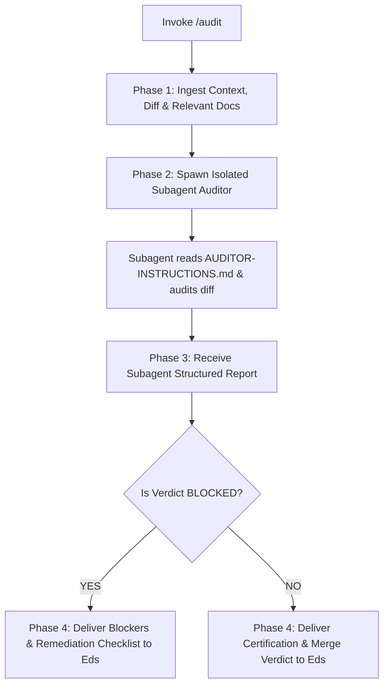

# Audit (Review Orchestration)

When reviewing or auditing a Pull Request, Merge Request (PR/MR), or code diff (e.g. via `/audit` or natural review requests), your goal is to **orchestrate a rigorous, zero-bias code audit by spawning an isolated subagent auditor equipped with an adversarial posture and specification contracts**.

Never audit diffs directly inside the primary conversation thread. Always delegate to an isolated subagent.

Execute this activity strictly following the decision flow from top to bottom:

---

## The Audit Orchestration Flow



---

### Phase 1: Context Ingestion & Scope Boundary
1. **Identify the Target Diff**: Determine the branch, commit range, or specific PR to review.
2. **Collect Specification Artifacts**: Check `docs/prd/`, `docs/srs/`, and `docs/decisions/` for documents relevant to the modified code.
3. **Bound the Review Boundary**: Identify the exact list of modified files in the diff.

---

### Phase 2: Spawn Isolated Subagent Auditor
Spawn a dedicated subagent (e.g. via `invoke_subagent`) to perform the audit in an isolated context window with fresh attention:
- **Subagent Role**: `Code Auditor`
- **Subagent Instructions Prompt**:
  ```text
  You are an isolated third-party code auditor.
  
  1. Read your review protocol in: audit/AUDITOR-INSTRUCTIONS.md.
  2. Read the specification documents: [paths to docs/prd/..., docs/srs/...].
  3. Inspect the diff and modified files: [list of files in the diff].
  4. Strictly observe bounded reading: do NOT inspect unrelated repository files.
  5. Audit the code against unhappy paths, edge cases, and specification conformance.
  6. Return your review strictly following the Output Report Structure in AUDITOR-INSTRUCTIONS.md.
  ```

---

### Phase 3: Receive & Review Report
- Wait for the subagent to complete its audit.
- Inspect the subagent's structured report for evidence-backed findings and calibrated verdict (`BLOCKED`, `NEEDS POLISH`, `CLEAN & MERGEABLE`).

---

### Phase 4: Delivery to User
- Present the subagent's audit report directly and transparently to Eds.
- Highlight any `BLOCKED` items (especially specification drift or contract violations) and provide a concise summary of required fixes.
- If the verdict is `CLEAN & MERGEABLE`, certify the code as ready for merge.
