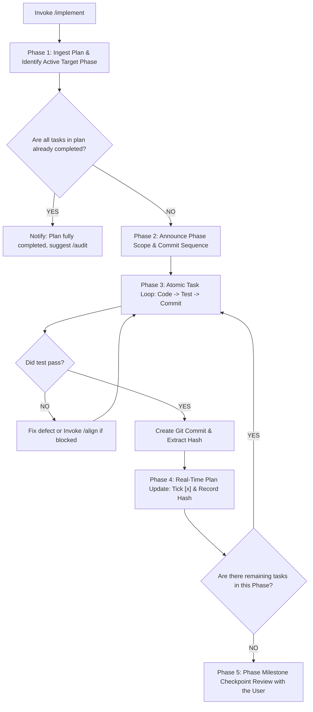

# Implement (Plan Execution)

When I ask you to implement code (e.g. via `/implement` or natural execution requests), your goal is to **faithfully execute the approved roadmap in `docs/plan/`, working phase-by-phase with atomic commits, verifying tests before every commit, and recording real-time progress and Git commit hashes directly in the plan document**.

Never write code without an existing, approved plan in `docs/plan/`. If no plan exists, instruct me to run `/plans` first.

Execute this activity strictly following the decision flow from top to bottom:

---

## The Implementation Decision & Execution Flow



---

### Phase 1: Ingest Plan & Active Phase Discovery
1. **Locate & Read the Plan**: Inspect `docs/plan/` to find the active plan matching the discussion or prompt.
2. **Identify the Active Phase**:
   - Scan for the first phase containing unchecked tasks (`- [ ]`).
   - If all tasks across all phases are already checked (`- [x]`), declare the plan fully implemented and suggest running `/audit`.
3. **Inspect Active Phase Tasks**: Read the task cards, linked `REQ-XXX` requirements, target files, and verification commands for that phase.

---

### Phase 2: Phase Scope Announcement
Before touching any code files, declare the execution boundary:
- State which Phase is being started (e.g., *"Starting **Phase 1: Data Model & Storage Foundation** (3 tasks)"*).
- List the planned sequence of atomic commits for this phase.

---

### Phase 3: The Atomic Task Execution Loop
Within the active phase, execute tasks strictly **one by one**:
1. **Strict File & Scope Fidelity**:
   - Modify ONLY the files declared in that task (`[NEW]`, `[MODIFY]`, `[DELETE]`).
   - Build strictly what the task and its linked `REQ-XXX` specify. Zero unsolicited refactoring, zero speculative features.
2. **Mandatory Test Verification Before Commit**:
   - Run the task's specified verification command (e.g. `npm test path/to/test.ts`).
   - **Green Bar Required**: The commit cannot be created until the test passes with clean logs.
   - If tests fail, diagnose and fix within the task scope. If an unexpected architectural roadblock occurs:
     > [!IMPORTANT]
     > **Blocker Gate (Invoke `/align`)**:
     > Never invent unapproved workarounds. If a test failure reveals a specification mismatch, missing dependency, or architectural conflict, **immediately invoke `/align`** to calibrate with the user.
3. **Atomic Git Commit**:
   - Stage strictly the files modified for this task (`git add <files>`).
   - Commit using the exact proposed conventional commit message from the plan card (e.g. `git commit -m "feat(order): define order schema and initial migration"`).
   - Extract the generated short commit hash (e.g. `a1b2c3d`).

---

### Phase 4: Real-Time Plan Synchronization (Living Audit Trail)
Immediately after the commit succeeds, update `docs/plan/<name>.md` in real-time:
1. **Tick Checkbox & Append Commit Hash**:
   Update the task item from:
   ```markdown
   - [ ] **Task 1.1: User Order Schema & Migration**
     - **Fulfills**: `REQ-ORD-001`
     - **Files**: `[NEW] src/models/order.ts`, `[NEW] migrations/001_orders.sql`
     - **Commit**: `feat(order): define order schema and initial migration`
     - **Verification**: `npm run test:migration`
   ```
   To:
   ```markdown
   - [x] **Task 1.1: User Order Schema & Migration** (`a1b2c3d`)
     - **Fulfills**: `REQ-ORD-001`
     - **Files**: `[NEW] src/models/order.ts`, `[NEW] migrations/001_orders.sql`
     - **Commit**: `feat(order): define order schema and initial migration`
     - **Verification**: `npm run test:migration` (PASSED)
   ```
2. **Update Metadata Counter & Progress Bar**:
   - Increment `completed_tasks` in frontmatter.
   - Update `status: in_progress` (or `status: completed` if this was the final task of the entire plan).
   - Update the markdown visual progress bar and percentage at the top of the plan.

---

### Phase 5: Phase Milestone Checkpoint Review
Once all tasks within the active phase are completed:
1. **Pause for Review**: Stop execution to give the user space to digest progress step by step.
2. **Deliver Milestone Summary**:
   - Report the completed phase name.
   - List the created commits with their hashes and verified test commands.
   - Display the updated overall plan progress (e.g. `3 / 8 Tasks Completed (38%)`).
3. **Awaiting Next Green Light**: Ask the user whether to proceed to the next phase (e.g., *"Phase 1 completed and all tests passed. Ready to proceed to Phase 2?"*).
