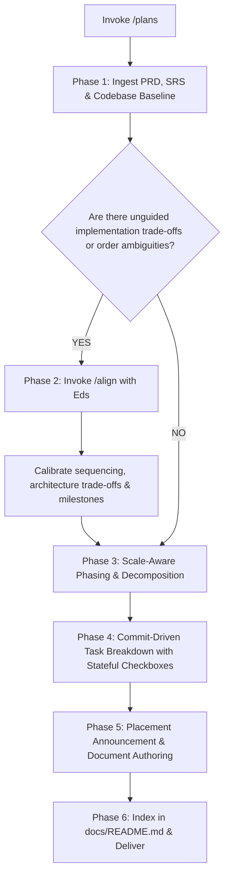

# Plans (Implementation Planning)

When I ask you to plan an implementation (e.g. via `/plans` or natural planning requests), your goal is to **translate approved PRD user outcomes and SRS technical specifications into a structured, step-by-step implementation plan where every discrete task maps directly to an atomic Git commit, complete with real-time stateful progress tracking**.

Do not generate ephemeral scratch plans in temporary directories. Always produce a durable, living document in `docs/plan/`.

Execute this activity strictly following the decision flow from top to bottom:

---

## The Planning Decision & Execution Flow



---

### Phase 1: Ingest PRD, SRS & Baseline Discovery
1. **Locate Specification Artifacts**: Check `docs/prd/` and `docs/srs/` for the approved feature requirements and technical contracts.
2. **Extract Key Constraints**:
   - Extract user journeys and scope boundaries from the PRD.
   - Extract functional requirements (`REQ-XXX`), schema models, API endpoints, and NFR thresholds from the SRS.
3. **Inspect Codebase Baseline**: Verify existing repository patterns, shared helpers, and dependencies so the plan builds upon what already exists.

---

### Phase 2: Technical Alignment Gate (Invoke `/align`)
> [!IMPORTANT]
> **Strictly No Unilateral Assumptions on Implementation Strategy**:
> If there are ambiguities regarding implementation order, library choices, breaking migration steps, or technical trade-offs:
> 1. **Immediately trigger the `/align` skill**.
> 2. Present the sequencing options or architectural trade-offs to Eds.
> 3. Calibrate and reach consensus on milestone boundaries before finalizing the plan.

---

### Phase 3: Scale-Aware Phasing & Decomposition
If the SRS is large or touches multiple layers, decompose the work into logical, sequential phases:
- **Phase 1: Data Model & Storage Foundation** (Schemas, migrations, repository layer).
- **Phase 2: Domain Logic & Core Services** (Business rules, validations, state machines).
- **Phase 3: Interfaces & External Integration** (HTTP/gRPC endpoints, background workers, event handlers).
- **Phase 4: Client & UI Integration** (Components, state hooks, visual styling).
- **Phase 5: Verification & End-to-End Hardening** (Integration tests, telemetry, documentation sync).

---

### Phase 4: Commit-Driven Task Breakdown (1 Task = 1 Commit)
In alignment with the core principle **"Take small steps"**, every task must represent a single, digestible, atomic Git commit:
- **Discrete & Self-Contained**: Each task must accomplish one focused change that can be reviewed, tested, and audited independently.
- **Stateful Task Checkbox**: Every task MUST begin with a GitHub-flavored markdown checkbox (`- [ ]`) to enable real-time tracking by downstream execution skills (e.g. `/implement`).
- **Explicit Commit Contract**: Every task in the plan must define:
  - **Checkbox & Title**: `- [ ] **Task X.Y: [Action Statement]**`
  - **Target Requirements**: Linked `REQ-XXX` from SRS or user stories from PRD.
  - **Affected Files**: Explicit list of files using `[NEW]`, `[MODIFY]`, or `[DELETE]`.
  - **Proposed Commit Message**: Conventional commit format (e.g. `feat(auth): implement argon2 password hashing`).
  - **Verification Step**: Concrete test command to run and verify before committing.

---

### Phase 5: Placement Announcement & Document Authoring
1. **Zero Stealth Writing**: Declare destination file path before writing:
   - Default target: `docs/plan/<feature-or-module-slug>.md` (e.g., `docs/plan/checkout-pipeline.md`).
2. **Required Implementation Plan Structure**:
   Structure the document with frontmatter (`title`, `type: plan`, `parent_prd`, `parent_srs`, `status: planned`, `total_tasks`, `completed_tasks`, `last_updated`):

   ```markdown
   ---
   title: Implementation Plan - [Feature Name]
   type: plan
   parent_prd: docs/prd/[feature].md
   parent_srs: docs/srs/[feature].md
   status: planned          # planned | in_progress | completed
   total_tasks: [Total Number]
   completed_tasks: 0
   last_updated: YYYY-MM-DD
   ---

   # Implementation Plan: [Feature Name]

   > **Progress Tracker:** `[░░░░░░░░░░░░░░░░]` **0 / [Total] Tasks Completed (0%)**

   ## 1. Context & Traceability
   - **Parent PRD**: [Link to docs/prd/...]
   - **Parent SRS**: [Link to docs/srs/...]
   - **Implementation Summary**: Brief summary of the deliverables and targeted milestones.

   ## 2. Component & Architecture Scope
   - High-level component diagram or list of impacted architectural modules.

   ## 3. Phased Execution Plan

   ### Phase 1: [Phase Name]

   - [ ] **Task 1.1: [Task Description]**
     - **Fulfills**: `REQ-[MODULE]-[INDEX]`
     - **Files**:
       - `[NEW]` `path/to/new-file.ts`
       - `[MODIFY]` `path/to/existing-file.ts`
     - **Commit**: `feat(module): clear conventional commit message`
     - **Verification**: `command to run tests (e.g. npm test path/to/test.ts)`

   - [ ] **Task 1.2: [Task Description]**
     ...

   ## 4. Verification & Test Strategy
   - Automated test suite commands across all phases.
   - Manual verification checkpoints.

   ## 5. Risk & Rollback Strategy
   - Database migration rollback plans and feature flag toggles.
   ```

3. **Downstream Execution Contract (For `/implement`)**:
   - The plan document serves as an executable state machine.
   - When a task is picked up by an execution workflow:
     1. Code changes are implemented strictly for that scoped task.
     2. Verification command is run and must pass.
     3. Atomic commit is executed.
     4. The checkbox in `docs/plan/<name>.md` is immediately checked (`- [x]`), `completed_tasks` count is incremented, and the progress bar is updated in real-time.

---

### Phase 6: Anti-Rot Indexing & Delivery
1. **Single Source of Map**: Open `docs/README.md` and catalog the new plan in the **Implementation Plans (Plan)** table with its title, linked SRS, status (`Planned`), progress (`0%`), and relative markdown link.
2. **Delivery**: Present an executive overview of the phases, total commit count, and initial execution roadmap in chat.
