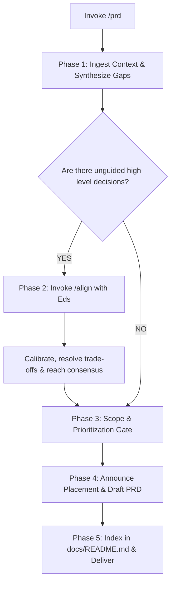

# PRD (Product Requirements Document)

When I ask you to write, draft, or refine a PRD (e.g. via `/prd` or natural requests), your goal is to **define the problem space and desired outcomes while leaving implementation details flexible for engineering**.

Execute this activity strictly following the decision flow from top to bottom:

---

## The PRD Decision & Execution Flow

---

### Phase 1: Ingest Context & Gap Synthesis
1. **Ingest the Raw Context**: Read the user prompt, issue thread, background discussion, and codebase state.
2. **Sort into Two Mental Buckets**:
   - **Directed & Settled**: Items where Eds has provided clear direction (problem statement, target user, core MVP need).
   - **Unguided High-Level Decisions (Gaps)**: Strategic trade-offs, scope boundaries, policy edge-cases, or monetization/business rules that have not yet been addressed.

---

### Phase 2: Alignment Gate (Invoke `/align`)
> [!IMPORTANT]
> **Strictly No Unilateral Assumptions on Unguided Decisions**:
> Never invent or silently assume high-level business or scope decisions. If gaps exist in Phase 1:
> 1. **Immediately trigger the `/align` skill**.
> 2. Present the identified gaps, compare viable options/trade-offs, and suggest recommendations.
> 3. Discuss and calibrate with Eds until we are on the same page.
> 4. Only proceed to Phase 3 once alignment is reached. (Any intentionally deferred items must be flagged as `[PENDING USER ALIGNMENT]`).

---

### Phase 3: Scope & Prioritization Gate
Before writing requirements, pass every capability through these filters:
1. **Problem-Oriented**: Does every feature directly solve the root problem identified? Eliminate surface-level bells and whistles.
2. **Outcome-Focused ("What", not "How")**: Focus on user capabilities and measurable impact. Leave technical architecture to engineering and the SRS.
3. **Rigorous Prioritization**:
   - **In-Scope (MVP)**: Strictly `Must-Have` (MoSCoW) or `P0` items required for launch.
   - **Out-of-Scope**: Explicitly list deferred items (`Won't-Have` / `P2`) to prevent scope creep.

---

### Phase 4: Placement Announcement & Document Authoring
1. **Zero Stealth Writing**: Declare destination file path before writing:
   - Default target: `docs/prd/<feature-slug>.md` (e.g., `docs/prd/user-onboarding.md`).
2. **Required 7-Section Document Structure**:
   Structure the document with frontmatter (`title`, `type: prd`, `status: Draft`, `last_updated`):

   - **Section 1: Metadata & Status**
     - Owner / Lead PM, cross-functional team (Design, Eng, QA, GTM), status (`Draft`/`In Review`/`Approved`), target release timeline.
   - **Section 2: Overview & Context**
     - Root problem statement, strategic alignment (OKRs/pillars), target audience & user personas.
   - **Section 3: Goals & Success Metrics**
     - Qualitative business goals and quantitative Key Results with baseline/target metrics (e.g., *"Reduce drop-off by 15%"*).
   - **Section 4: Scope & Constraints**
     - In-Scope (MVP), Out-of-Scope (deferred), business/regulatory constraints, and budget/timeline assumptions.
   - **Section 5: Requirements**
     - Critical User Journeys (CUJs) / User Stories (*Given-When-Then* or step-by-step).
     - Functional requirements & business logic rules.
     - High-level Non-Functional Requirements (accessibility, security expectations, performance targets).
   - **Section 6: Design & Technical References**
     - Links to Figma wireframes/mockups and links to technical design docs / SRS.
   - **Section 7: Launch, Risk & Appendix**
     - Operational risks & mitigation, rollout/GTM strategy (feature flags, canary), open questions, and decision log.

---

### Phase 5: Anti-Rot Indexing & Delivery
1. **Single Source of Map**: Open `docs/README.md` and catalog the new document in the **Product Requirements (PRD)** table with its title, status, and relative markdown link.
2. **Executive Delivery**: Provide a concise summary in the chat, listing the key outcomes and any remaining open questions.
