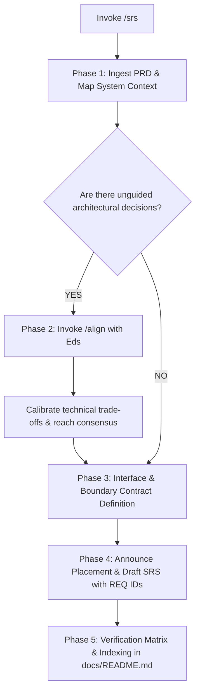

# SRS (Software Requirements Specification)

When I ask you to write, specify, or break down software requirements (e.g. via `/srs` or natural requests), your goal is to **translate high-level PRD needs into unambiguous, testable, and traceable technical specifications that serve as a binding engineering contract**.

Execute this activity strictly following the decision flow from top to bottom:

---

## The SRS Decision & Execution Flow

---

### Phase 1: Ingest PRD & Architectural Discovery
1. **Locate & Read the Parent PRD**: Inspect `docs/prd/` to anchor software requirements in approved user journeys and scope boundaries.
2. **Map System Boundaries & Gaps**:
   - Identify actors (human users, background workers, external APIs).
   - Sort technical requirements into:
     - **Settled Technical Baseline**: Stack choices, existing repo patterns, and directed infrastructure.
     - **Unguided Architectural Decisions (Gaps)**: Data consistency models, auth mechanisms, external vendors, or state-storage trade-offs that Eds has not directed.

---

### Phase 2: Technical Alignment Gate (Invoke `/align`)
> [!IMPORTANT]
> **Strictly No Unilateral Assumptions on Technical Decisions**:
> Never assume or unilaterally lock in high-level architecture, database paradigms, security models, or third-party dependencies. If technical gaps exist in Phase 1:
> 1. **Immediately trigger the `/align` skill**.
> 2. Present the architectural trade-offs (e.g., stateless vs. session-based, polling vs. webhooks, SQL vs. NoSQL) with concrete pros and cons.
> 3. Calibrate with Eds to reach a firm technical decision.
> 4. Only proceed to Phase 3 once shared intuition is established.

---

### Phase 3: Interface & Boundary Contract Filtering
Before writing numbered requirements, enforce these technical filters:
1. **Zero Ambiguity**: Eliminate subjective adjectives (*"fast"*, *"robust"*, *"scalable"*). Replace with explicit numeric thresholds, status codes, and schema types.
2. **Unhappy Path as First-Class Citizen**: Define edge cases, network dropouts, rate limits, invalid payloads, and timeout recovery alongside normal execution.
3. **Traceability Guarantee**: Every capability must have a unique identifier (`REQ-[MODULE]-[INDEX]`) that links back to a PRD requirement and forward to a test suite.

---

### Phase 4: Placement Announcement & Specification Authoring
1. **Zero Stealth Writing**: Declare destination file path before writing:
   - Default target: `docs/srs/<module-slug>.md` (e.g., `docs/srs/auth-service.md`).
2. **Required 7-Section Document Structure**:
   Structure the document with frontmatter (`title`, `type: srs`, `parent_prd`, `status: Draft`, `last_updated`):

   - **Section 1: Metadata, Versioning & Traceability**
     - Specification version (`v1.0.0`), status, authors/reviewers, and explicit links to parent PRD (`docs/prd/xxx.md`) and ADRs.
   - **Section 2: System Overview & Architectural Context**
     - Scope boundaries, system actors, and C4/Mermaid architecture diagram showing service context and data stores.
   - **Section 3: External Interface Requirements**
     - UI/Frontend contracts, API endpoint definitions (REST/gRPC/GraphQL), payload schemas, runtime environment limits, and communication protocols (TLS/HTTP2).
   - **Section 4: Functional Requirements (System Capabilities)**
     - Systematically grouped by module with unique identifiers:
       - **ID**: `REQ-[MODULE]-[INDEX]` (e.g., `REQ-AUTH-001`).
       - **Inputs & Preconditions**: Validated parameters, data types, and session prerequisites.
       - **Processing & Logic**: Step-by-step processing, state machine mutations, and side effects.
       - **Outputs & Status Codes**: Expected response payload and HTTP/RPC status codes.
       - **Failure Modes & Error Handling**: Explicit error codes, schemas, and fallback behaviors.
   - **Section 5: Non-Functional Requirements (NFRs)**
     - Quantitative latency percentiles (p50/p95/p99), throughput (RPS), security/auth models, uptime SLA, and resource limits.
   - **Section 6: Data Models & Schema Specifications**
     - Logical/physical entity schemas, primary/foreign keys, indexes, ACID/consistency boundaries, and data retention/purging rules.
   - **Section 7: Verification Matrix, Constraints & Dependencies**
     - Technical platform constraints, third-party vendor SLAs, and outage fallback strategies.

---

### Phase 5: Verification Matrix, Anti-Rot Indexing & Delivery
1. **Verification Matrix**: Include an unambiguous table mapping every `REQ-XXX` identifier to its automated verification strategy (`Unit Test`, `Integration Test`, `Load Test`, `Contract Test`).
2. **Single Source of Map**: Open `docs/README.md` and catalog the new SRS in the **Software Requirements (SRS)** table with its title, linked parent PRD, status, and relative markdown link.
3. **Delivery**: Report the generated specification path, linked PRD, and key interface contracts in chat.
